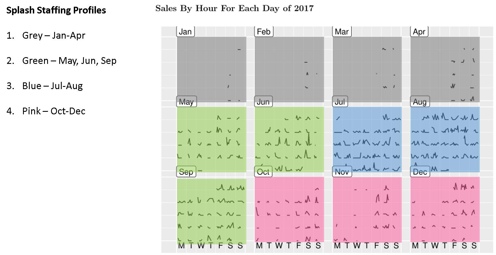

```{r setup, include=FALSE}
knitr::opts_chunk$set(echo = TRUE)

#SPLASH
# next step is try to look for trends
# are there staffing changes to be made or will it always be same #

library(dplyr)
library(ggplot2)
library(sugrrants)
library(lubridate)
library(knitr)
library(scales)
library(gridExtra)
library(fpp2)
#library(prophet)

#data.clean <- read.csv("data/mutated.data1417.csv", stringsAsFactors = FALSE)

#####
import.jh.sql.connect <- function(db.name.in.sql.server){
  library(odbc)
  library(DBI)
  
  con <- DBI::dbConnect(odbc::odbc(),
                        Driver = "SQL Server",
                        Server = "LAPTOP-JHRVTF04\\SQLEXPRESS",
                        Database = db.name.in.sql.server,
                        Trusted_Connection = "True")
  con
}

import.jh.detailed.sales <- function(){
  joined.df <- DBI::dbGetQuery(con,'
                                SELECT TransactionEntry.ItemID, TransactionEntry.Price, 
                                 TransactionEntry.TransactionTime, TransactionEntry.Quantity, 
                                  TransactionEntry.TransactionNumber, Item.Description, 
                                 Department.Name AS "Department", Category.Name AS "Category", 
                                 SupplierName AS "Supplier", Cashier.Name AS "CashierName", 
                                 Register.Number AS "Register", Register.Description AS "RegLocation"

                                 FROM TransactionEntry
                                 
                                 JOIN Item ON TransactionEntry.ItemID = Item.ID
                                 JOIN Department ON Item.DepartmentID = Department.ID
                                 JOIN Category ON Item.CategoryID = Category.ID
                                 JOIN Supplier ON Item.SupplierID = Supplier.ID
                                 JOIN [Transaction] ON TransactionEntry.TransactionNumber = [Transaction].TransactionNumber
                                 JOIN Batch ON [Transaction].BatchNumber = Batch.BatchNumber
                                 JOIN Register ON Batch.RegisterID = Register.ID
                                 JOIN Cashier ON [Transaction].CashierID = Cashier.ID')
  joined.df
  }

clean.jh.detailed.sales <- function(sql.df){
  library(dplyr)
  library(lubridate)
    
    sql.df <- sql.df %>%
      rename(Sold.Price = Price, Cashier = CashierName, Date.Sold = TransactionTime,
             Qty.Sold = Quantity, Transaction = TransactionNumber) %>%
      mutate(Total.Sales = Qty.Sold*Sold.Price) %>%
      select(Department, Category, Supplier, ItemID, Description, Qty.Sold, Sold.Price, 
             Total.Sales, Transaction, Date.Sold, Register, Cashier)
    
    sql.df$Date.Sold <- ymd_hms(sql.df$Date.Sold)
    sql.df$Year <- year(sql.df$Date.Sold)
    sql.df$Month <- month(sql.df$Date.Sold)
    sql.df$Department <- trimws(sql.df$Department)
    sql.df$Category <- trimws(sql.df$Category)
    sql.df$Supplier <- trimws(sql.df$Supplier)
    sql.df$Item <- trimws(sql.df$Item)
    #print(head(sql.df))
    sql.df$Dept.By.Year <- paste(sql.df$Department, sql.df$Year)
    sql.df$Categ.By.Year <- paste(sql.df$Category, sql.df$Year)
    sql.df
}
if(file.exists(paste0("data/sales.data.cache", Sys.Date(), ".csv"))){
  data.clean <- read.csv(paste0("data/sales.data.cache", Sys.Date(), ".csv"), stringsAsFactor = FALSE)
} else {
con <- import.jh.sql.connect("WHALESTALE")

new.df <- import.jh.detailed.sales() # uses con but not as argument

data.clean <- clean.jh.detailed.sales(new.df)

write.csv(data.clean, paste0("data/sales.data.cache", Sys.Date(), ".csv"), row.names = FALSE)
}
#####
#data4years <- read.csv("mutated.data1417.csv", stringsAsFactors = FALSE)
data4years <- data.clean
data4years <- filter(data4years, Register == "9")

data4years.wide <- data4years
data4years.wide$Date.Sold <- as_datetime(data4years.wide$Date.Sold)
data4years.wide$Date.Sold.Round <- floor_date(data4years.wide$Date.Sold, unit = "hour")
data4years.wide$Date.Sold <- as_date(data4years.wide$Date.Sold)

data18 <- filter(data4years.wide, Year == 2018)

data18 <- data18[!duplicated(data18$Transaction),] ## makes only one row per transaction

data18.agg <- aggregate(Total.Sales ~ Date.Sold.Round + Date.Sold, data18, length) ### switched from sum to length
data18.agg <- data18.agg %>%
  mutate("Hour" = as.integer(hour(Date.Sold.Round))) %>%
  frame_calendar(x = Hour, y = Total.Sales, date = Date.Sold, calendar = "monthly")
data18.plot <- data18.agg %>%
  ggplot(aes(x = .Hour, y = .Total.Sales, group = Date.Sold)) + geom_line()

```

# DISREGARD ALL TEXT

#### Question To Answer: How can sales data help inform staffing levels through the day through each month of the year?

#### Approach To Answer Question:

1. Visualize 2017 sales by hour for each day of the year in order to see trends (also visualize 2016 to confirm it's fairly similar to 2017)

2. Group together similar days into a number of "sales profiles" for consistency and simplicity.

3. Plot the range of sales that happen through the day for each of the profiles.

## Sales By Hour For Each Day of 2018

```{r calendar.18.plot, echo=FALSE}
#print(unique(data4years$Register))
prettify(data18.plot)
```

## Comments and Trends

Trends were harder to identify for Splash.  I began by just substituting the Splash data for the Whale's Tale data, but the dollar amounts differed wildly and almost randomly.  I then switched from sales dollars to items sold but that similarly had unpredictable variation.  Lastly, I looked at transaction data.  The transaction data had fewer huge spikes but still the transactions followed almost a random pattern.

I came away thinking that working at the Splash location is a little bit like playing outfield in baseball.  You might get no action for long periods, but you better be ready when the action does come.

There's a risk in analysis like this called overfitting such as saying "The 3rd Saturday in August was huge so next year schedule extra help just for that one day".  I really couldn't find many patterns beyond expected monthly seasonality, but this by itself is a useful finding.  I looked for trends like "Mornings on Weekdays are usually _____", "The final hours of the day are often ______", "the busiest time of day is _____", "the busiest or the lightest day of the week is _____", and none of them led to a solid trend.

In the end, I went with four profiles, as shown in the colors below.  I haven't matched these to staffing levels because I haven't gotten as much info about how Splash is staffed; what the maximum and minimum staffing levels would be, etc.  Still this should provide a useful picture of the possible transaction levels.

## Sales By Hour For Each Day of 2017

```{r calendar.17.plot, echo=FALSE}
data17 <- filter(data4years.wide, Year == 2017)

data17 <- data17[!duplicated(data17$Transaction),] ## makes only one row per transaction

data17.agg <- aggregate(Total.Sales ~ Date.Sold.Round + Date.Sold, data17, length) # changed from sum
data17.agg <- data17.agg %>%
  mutate("Hour" = as.integer(hour(Date.Sold.Round))) %>%
  frame_calendar(x = Hour, y = Total.Sales, date = Date.Sold, calendar = "monthly")
data17.plot <- data17.agg %>%
  ggplot(aes(x = .Hour, y = .Total.Sales, group = Date.Sold)) + geom_line()
prettify(data17.plot)

```


```{r off.peak.minimum, echo=FALSE}

data2years.wide <- filter(data4years.wide, Year %in% c(2017, 2018))

#data2years$Date.Sold <- as_date(data2years$Date.Sold)

data2years.wide <- data2years.wide %>%
  mutate("Hour" = hour(Date.Sold.Round)) %>%
  mutate("Weekday" = wday((Date.Sold.Round)))
    
# filter for off.peak.minimum ##
#df1 <- data2years.wide %>%
#  filter(Date.Sold >= "2016-01-01", Date.Sold <= "2016-01-31")
#df2 <- data2years.wide %>%
#  filter(Date.Sold >= "2016-02-01", Date.Sold <= "2016-04-07", Weekday %in% c(1, 2, 3, 4, 5, 7))

#df.all <- rbind(df1, df2)

staffing.day.plot.dots <- function(df, nickname.of.time.range){
  
  library(lubridate)
  library(dplyr)
  library(ggplot2)
  
  df.agg <- aggregate(Total.Sales ~ Date.Sold.Round + Hour + Weekday, df, sum)
  conf.df <- data.frame()
  
  for(i in 9:23){
    #print(i)
    i.hour.vec <- df.agg %>%
      filter(Hour == i) %>%
      select(Total.Sales)
    #i.hour.vec <- as.double(i.hour.vec)
    #print(head(i.hour.vec))
    #i.estimate.95 <- t.test(i.hour.vec, conf.level = 0.95)$estimate
    #i.conf.int.95 <- t.test(i.hour.vec, conf.level = 0.95)$conf.int
    #i.conf.int.75 <- t.test(i.hour.vec, conf.level = 0.75)$conf.int
    #i.conf.int.50 <- t.test(i.hour.vec, conf.level = 0.50)$conf.int
    #three.conf.int <- c(i, i.estimate.95, i.conf.int.95, i.conf.int.75, i.conf.int.50)
    quantiles <- quantile(as.numeric(unlist(i.hour.vec)), probs = c(.5, .025, .975, .125, .875, .25, .75))
    #print(class(quantiles))
    
    quantiles.hour <- c(i, quantiles)
    #print(class(quantiles.hour))
    conf.df <- rbind(conf.df, quantiles.hour)
    
    #i.estimate.95 <- quantie(i.hour.vec, .5)
    #i.conf.int.95.high <- 
    #quantiles.hour <- c(i, quantile(i.hour.vec, c(.5, .025, .975, .125, .875, .25, .75)))
  }
  colnames(conf.df) <- c("hour", "estimate", "low95", "high95", "low75", "high75", "low50", "high50")
  
  # add column corresponding to # of staff needed based on $400 -> 2, $600 -> 3, etc
  conf.df$staff.estimate <- (round(conf.df$high50/200))
  
  lbls = paste0(as.character(c(seq(9, 12, 1), seq(1, 11, 1))), c(rep("am", 3), rep("pm", 11)))
  brks <- seq(9,23, 1)
  
  lbls.y = paste0("$", seq(0, 2000, 200))
  brks.y = seq(0, 2000, 200)
  brks.y2 = seq(0,8,1)
  
  #removing dots because not based on anything for Splash
  day.plot <- ggplot(data = conf.df, aes(x=hour)) +
    geom_ribbon(aes(ymin=low95, ymax=high95), fill="#0571b0", alpha = .75)+
    geom_ribbon(aes(ymin=low75, ymax=high75), fill="#92c5de", alpha = .75)+
    geom_ribbon(aes(ymin=low50, ymax=high50), fill="#d1e5f0", alpha = .75)+
    geom_ribbon(aes(ymin=estimate-5, ymax=estimate+5), fill="#ef8a62") #+
    #geom_point(aes(y=staff.estimate*200), color="#FFFF33", size = 10) +
    #geom_text(aes(y = staff.estimate*200, label = staff.estimate), color = "black", size = 5, fontface = "bold")
  day.plot <- day.plot + scale_x_continuous(labels = lbls, breaks = brks) + 
    scale_y_continuous(sec.axis = sec_axis(~./200, name = "Estimate of Hourly Staff Need", breaks = brks.y2), labels = lbls.y, breaks = brks.y, name = "Range of Hourly Sales") #+ ylim(0,2000)
  #print(head(conf.df, 15))
  print(day.plot)
}

staffing.day.plot.dept3.transactions <- function(df, nickname.of.time.range, palette.color = "green.palette"){
  
  green.palette <- c("#238b45", "#74c476", "#bae4b3")
  red.palette <- c("#cb181d", "#fb6a4a", "#fcae91")
  purple.palette <- c("#6a51a3", "#9e9ac8", "#cbc9e2")
  orange.palette <- c("#d94701", "#fd8d3c", "#fdbe85")
  lavender.palette <- c("#ae017e", "#f768a1", "#fbb4b9")
  
  if(palette.color == "green.palette"){
    dark.color = green.palette[1]
    medium.color = green.palette[2]
    light.color = green.palette[3]
  }else if(palette.color == "red.palette"){
    dark.color = red.palette[1]
    medium.color = red.palette[2]
    light.color = red.palette[3]
  }else if(palette.color == "purple.palette"){
    dark.color = purple.palette[1]
    medium.color = purple.palette[2]
    light.color = purple.palette[3]
  }else if(palette.color == "orange.palette"){
    dark.color = orange.palette[1]
    medium.color = orange.palette[2]
    light.color = orange.palette[3]
  }else if(palette.color == "lavender.palette"){
    dark.color = lavender.palette[1]
    medium.color = lavender.palette[2]
    light.color = lavender.palette[3]
  }
  
  library(lubridate)
  library(dplyr)
  library(ggplot2)
  
  df <- filter(df, Register == "9")
  df <- df[!duplicated(df$Transaction),] # one row per transaction
  
  df.agg <- aggregate(Total.Sales ~ Date.Sold.Round + Hour + Weekday, df, length) # unit switched to length
  conf.df <- data.frame()
  
  for(i in 9:23){
    #print(i)
    i.hour.vec <- df.agg %>%
      filter(Hour == i) %>%
      select(Total.Sales)

    quantiles <- quantile(as.numeric(unlist(i.hour.vec)), probs = c(.5, .025, .975, .125, .875, .25, .75))
    
    quantiles.hour <- c(i, quantiles)
    conf.df <- rbind(conf.df, quantiles.hour)

  }
  colnames(conf.df) <- c("hour", "estimate", "low95", "high95", "low75", "high75", "low50", "high50")
  
  # add column corresponding to # of staff needed based on $400 -> 2, $600 -> 3, etc
  conf.df$staff.estimate <- (round(conf.df$high50/200))
  
  lbls = as.character(c(seq(9, 12, 1), seq(1, 11, 1)))#, c(rep("am", 3), rep("pm", 11)))
  brks <- seq(9,23, 1)
  
  lbls.y = paste0("$", seq(0, 2000, 200))
  brks.y = seq(0, 2000, 200)
  brks.y2 = seq(0,8,1)
  
  day.plot <- ggplot(data = conf.df, aes(x=hour)) +
    geom_ribbon(aes(ymin=low95, ymax=high95), fill=dark.color, alpha = .75)+
    geom_ribbon(aes(ymin=low75, ymax=high75), fill=medium.color, alpha = .75)+
    geom_ribbon(aes(ymin=low50, ymax=high50), fill=light.color, alpha = .75)+
    geom_ribbon(aes(ymin=estimate-.2, ymax=estimate+.2), fill="black") + ylab("Transactions Per Hour")
    #geom_point(aes(y=staff.estimate*200), color="#FFFF33", size = 10) #+
  #scale_y_continuous(labels = scales::dollar)  
  #geom_text(aes(y = staff.estimate*200, label = staff.estimate), color = "black", size = 5, fontface = "bold")
  day.plot <- day.plot + scale_x_continuous(labels = lbls, breaks = brks) + 
    ggtitle(nickname.of.time.range)
    #scale_y_continuous(sec.axis = sec_axis(~./200, name = "Estimate of Hourly Staff Need", breaks = brks.y2), labels = lbls.y, breaks = brks.y, name = "Range of Hourly Sales") #+ ylim(0,2000)
  #print(head(conf.df, 15))
  #print(day.plot)
  day.plot

}
```

## Profiles of Sales For Staffing



\newpage

# Sales Ranges of Profiles

The next 4 plots show the range of sales that have occurred for each hour of the day.  The darkest, largest blue range represents where sales occur that hour 95% of the time.  The next slightly lighter blue range represents where hourly sales will fall 75%.  The smallest, lightest blue contains hourly sales 50% of the time.  The red ribbon is the average sales level for that hour.

In purple is a similar plot based on transactions by hour rather than sales dollars by hour.  The ranges for light purple, medium purple, and dark purple are the same as described above for the blues.

##### Approximate Staffing Needs At Hourly Sales Levels

```{r staffing.kable, echo=FALSE}

staffing.table <- data.frame("Sales Per Hour" = c("$400", "$600", "$800", "$1000", "$1200"), "Staff Needed" = c(2, 3, 4, 5, 6))

#kable(staffing.table)
```

Below are the plots of each profile:

\newpage

## #1 Jan-Apr - Grey
This blue plot is likely affected by a small sample size, but it does point to the fact that bigger purchases seemed to happen "first thing" but still only 1 transaction per hour at that time (based on purple plot)

```{r Off.Peak.Min, echo=FALSE, warning=FALSE, message=FALSE, fig.height= 4}

df.off.peak <- data2years.wide %>%
  filter(Date.Sold >= "2018-01-01", Date.Sold <= "2018-04-30")
#df2 <- data2years.wide %>%
#  filter(Date.Sold >= "2017-01-01", Date.Sold <= "2017-04-30")

#df.all <- rbind(df1, df2)
staffing.day.plot.dots(df.off.peak)
```


```{r,echo=FALSE, fig.height= 4}
staffing.day.plot.dept3.transactions(df.off.peak, "Jan-Apr Transactions", palette.color = "purple.palette")
```

\newpage

## #2 May, Jun, Sep - Green
If you were to add a second person or have people overlap, the 2-3pm or possibly 1-3pm time period is most likely to have more customers and more dollars.  The dark blue rising higher in the morning means that occasionally there are more sales and customers during that 10-1 period.

```{r near.peak, echo=FALSE, message=FALSE, warning=FALSE, fig.height= 4}

df1 <- data2years.wide %>%
  filter(Date.Sold >= "2018-05-01", Date.Sold <= "2018-06-30")
#df2 <- data2years.wide %>%
#  filter(Date.Sold >= "2017-05-01", Date.Sold <= "2017-06-30")
df3 <- data2years.wide %>%
  filter(Date.Sold >= "2018-09-01", Date.Sold <= "2018-09-30")
#df4 <- data2years.wide %>%
#  filter(Date.Sold >= "2017-09-01", Date.Sold <= "2017-09-30")

df.all <- rbind(df1, df3)
staffing.day.plot.dots(df.all)
```


```{r,echo=FALSE, fig.height= 4}
staffing.day.plot.dept3.transactions(df.all, "May, Jun, Sep Transactions", palette.color = "purple.palette")
```

\newpage

## #3 Jul-Aug - Blue
This period provides a similar picture where 2-3pm is the timeframe most likely to have higher sales and more transactions per hour.  Keep in mind that even during that time there are on average only 2 purchases per hour, but that wouldn't account for people browsing and not buying who also need to get their questions answered.


```{r Spring.Fri.Sat.Tan.Mid.ApriltoMay, echo=FALSE, warning=FALSE, fig.height= 4}

df.peak <- data2years.wide %>%
  filter(Date.Sold >= "2018-07-01", Date.Sold <= "2018-08-31")
#df2 <- data2years.wide %>%
#  filter(Date.Sold >= "2017-07-01", Date.Sold <= "2017-08-31")

#df.all <- rbind(df1, df2)
staffing.day.plot.dots(df.peak)
```


```{r,echo=FALSE, fig.height= 4}
staffing.day.plot.dept3.transactions(df.peak, "Jul-Aug Transactions", palette.color = "purple.palette")
```

\newpage

## #4 Oct-Dec - Pink
Sales are typically low during this period but at 6pm and 8pm there are sometimes increases. I don't know whether it would warrant additional staffing but those are the times it's most likely for Splash to be busy during this period.

```{r Spring.Sundays, echo=FALSE, warning=FALSE, fig.height= 4}

df.q4 <- data2years.wide %>%
  filter(Date.Sold >= "2018-10-01", Date.Sold <= "2018-12-31")
#df2 <- data2years.wide %>%
#  filter(Date.Sold >= "2017-10-01", Date.Sold <= "2017-12-31")

#df.all <- rbind(df1, df2)
staffing.day.plot.dots(df.q4)
```

```{r,echo=FALSE, fig.height= 4}

staffing.day.plot.dept3.transactions(df.q4, "Oct-Dec Transactions", palette.color = "purple.palette")
```

